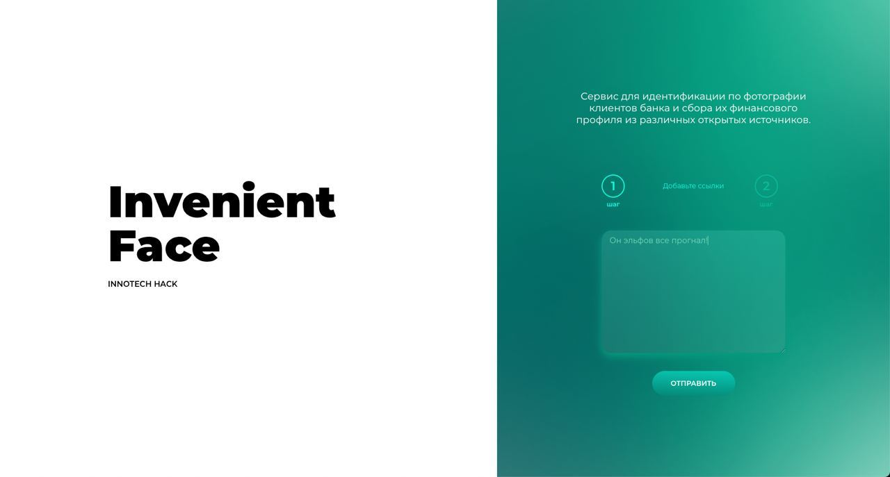
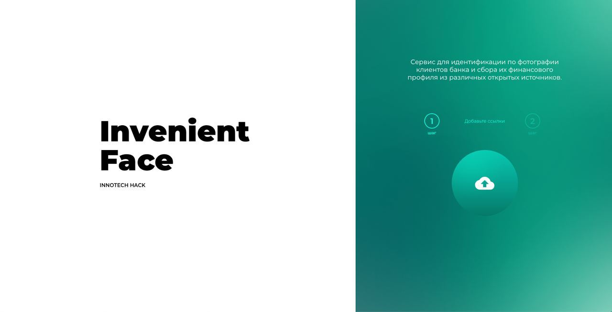
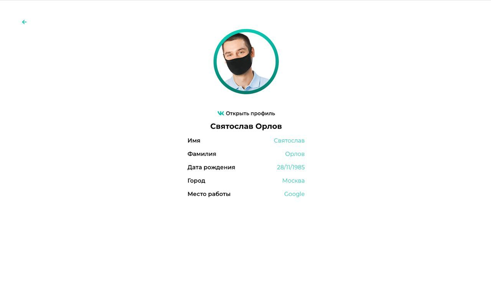

# Inveniet Face

[](https://travis-ci.org/joemccann/dillinger)

Для взаимодействия с API Вконтакте используется модуль vk. 
Поиск и распознавание лица происходит с помощью библиотеки DLIB http://dlib.net/

# Запуск проекта:

  - скопировать файл .env.dev в папку innotech_hackaton/backend/ и переименовать в .env
  - добавить в .env VK Token. Сделать его можно по ссылке, создав Standalone-приложение https://vk.com/apps?act=manage
  - если нет на компьютере, то установить docker-compose по ссылке https://docs.docker.com/compose/install/
  - в корне проекта (innotech_hackaton) запустить команду: 
    ```sh
    $ docker-compose up -d --build
    ```


# Работа с приложением
  - вставить ссылку пользователя вида *https://vk.com/username* из социальной сети ВКонтакте в форму и нажать кнопку отправить (ВАЖНО! пока приложение работает только если на аватарке страницы вк изображен один человек)
  
  
  
  - после перехода на страницу загрузки изображения вставить фото пользователя вк и нажать кнопку отправить
  
  
  
  - на следующей странице будет выведен результат
  

# Технологии

Для создания нашего проекта мы использовали следующие технологии:

* [ReactJS] - фронтенд фреймворк
* [Django] - бэкенд фреймворк
* [TypeScript] - язык программирования
* [Python] - язык программирования

